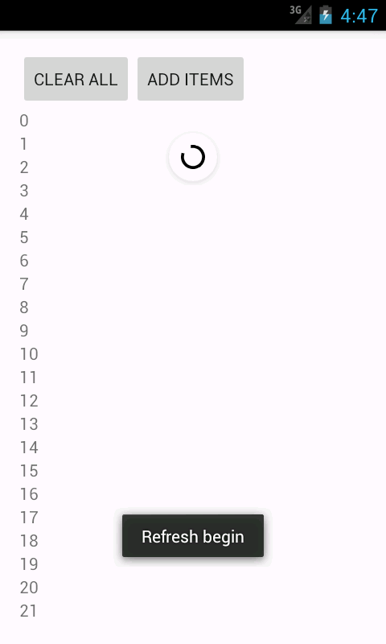

### SwipeRefreshRecyclerView

Features:

* Pull down to refresh (下拉刷新)
* Pull up to load more (上拉加载更多)
* Show custom empty view when list is empty (列表为空时显示自定义的空视图)



### Integration 集成

```groovy
repositories {
    ...
    maven { url "https://jitpack.io" }
}

dependencies {
    compile 'com.github.whinc:SwipeRefreshRecyclerView:1.1.0'
}
```

### How to use 使用

```java
// Find view
final SwipeRefreshRecyclerView refreshRecyclerView
        = (SwipeRefreshRecyclerView) findViewById(R.id.swipe_refresh_recycler_view);

// Get RecyclerView and setup Adapter
RecyclerView recyclerView = refreshRecyclerView.getRecyclerView();
recyclerView.setLayoutManager(new LinearLayoutManager(this));
recyclerView.setAdapter(new MyAdapter());

// Setup empty view
View emptyView = swipeRefreshRecyclerView.setEmptyView(R.layout.include_empty_view);

// Listener to refresh event
refreshRecyclerView.setOnRefreshListener(new SwipeRefreshLayout.OnRefreshListener() {
    @Override
    public void onRefresh() {
        Toast.makeText(MainActivity.this, "Refresh begin", Toast.LENGTH_SHORT).show();
        new Handler().postDelayed(new Runnable() {
            @Override
            public void run() {
                refreshRecyclerView.setRefreshing(false);
                Toast.makeText(MainActivity.this, "Refresh end", Toast.LENGTH_SHORT).show();
            }
        }, 3000);
    }
});

// Listener to load more event
refreshRecyclerView.setOnLoadMoreListener(new SwipeRefreshRecyclerView.OnLoadMoreListener() {
    @Override
    public void onLoadMore() {
        Toast.makeText(MainActivity.this, "load more begin", Toast.LENGTH_SHORT).show();
        new Handler().postDelayed(new Runnable() {
            @Override
            public void run() {
                refreshRecyclerView.setLoading(false);
                Toast.makeText(MainActivity.this, "load more finish", Toast.LENGTH_SHORT).show();
            }
        }, 3000);
    }
});
```

### Internal Implementation 内部实现

`SwipeRefreshRecyclerView`是一个组合控件，其继承自`SwipeRefreshLayout`，内部包含一个`RecyclerView`，就这样简单的组合就已经可以实现下拉刷新了。为了实现列表滚动到最后一项时加载更多，`SwipeRefreshRecyclerView`监听了`RecyclerView`的触摸事件，一旦发现发现列表滚动到最后一项并满足条件，就触发load more事件。
